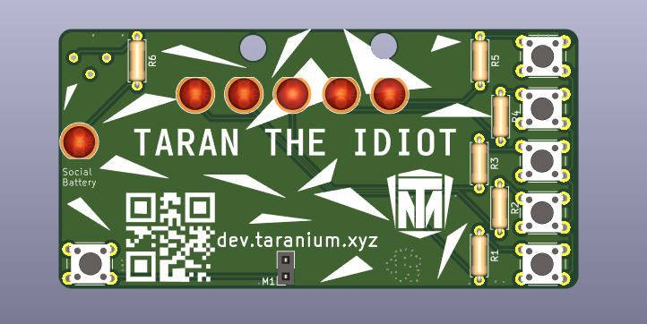
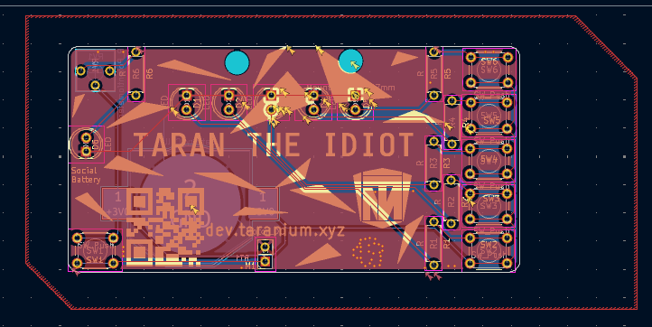
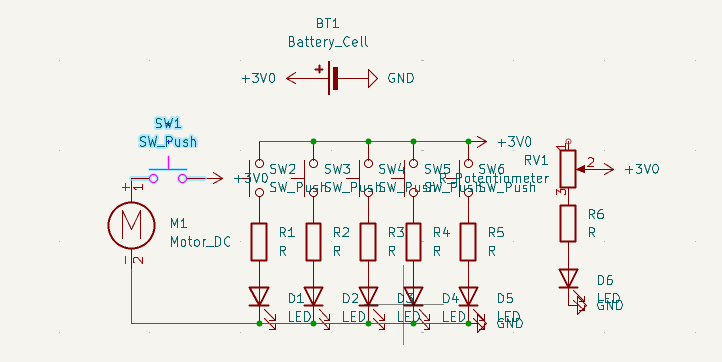

# Name-Card

Hello!\
This is a name card I made for me to wear at hackathons and events.\
It has 6 leds, 6 Buttons, and a Buzzer, all powered on a CR2032 Cell Battery.

## What This does

This is a nametag that clips onto your shirt with a safety pin.\
It has 5 LEDs that turn on through buttons on the right and a buzzer that turns on through the button on the left.\
The 6th LED is to express my social battery as it depreciates throughout the day.\
All of this runs on a 3V CR2032 cell battery

## PCB

\

## Schematic

## How to Build

Go to any pcb maker and give them the production files.\
Order The parts and solder them onto the pcb\
Yay you did it.

OPTIONAL: You can edit the pcb files and personalise it a bit

## BOM

6 LEDs(Various colours)\
6 6mm Buttons\
7 220 Ohm Resistors\
1 CR2032 Battery Holder\
1 Poteniometer\
1 CR2032 Battery\
1 Buzzer\
1 PCB

Made By `@Taran The Idiot` from Hack Club

